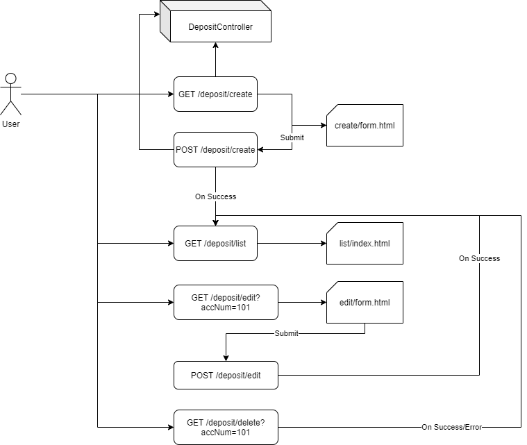

# End to End demo with Spring WebMVC, Spring Data-JPA and Spring Boot

## Application Architecture 

 

## Dependencies

* spring-boot-starter-web
* spring-boot-starter-thymeleaf
* spring-boot-starter-data-jpa
* spring-boot-starter-devTools
* h2database (Can be replaced with Oracle or MySQL)

## Create a new Spring Starter project with all required dependencies

1. Model class `Deposit`

    ```java
    @Entity //An Object which is LINKED to DB Table
    @Table(name="deposits") //Name of Linked Table
    public class Deposit {
        
        @Id @Column(name="acc_id")
        private Integer accNumber;
        
        @Column(name="cust_name",length = 25)
        private String custName;
        
        @Column(name="amount",precision = 2, scale = 15)
        private Double amount;
        //Getters, Setters & Constructors...
    ```

2.  Modify my `application.properties`

    ```ini
    spring.datasource.url=jdbc:h2:mem:db1
    spring.datasource.username=hr
    spring.datasource.password=hr
    spring.datasource.driver-class-name=org.h2.Driver
    ## instruct hibernate (ORM) to create all SQL Queries compatible with H2 Database
    spring.jpa.database-platform=org.hibernate.dialect.H2Dialect
    ## DEBUG : display generated SQL queries in CONSOLE
    spring.jpa.show-sql=true
    ## Create the TABLES on-the-fly!!!!
    spring.jpa.generate-ddl=true
    spring.h2.console.enabled=true
    ```

3.  Create Repository Interface `DepositRepository`

    ```java
    import org.springframework.data.repository.CrudRepository;
    import org.springframework.stereotype.Repository;

    import com.mahendra.mvcproject.models.Deposit;

    @Repository
    public interface DepositRepository extends CrudRepository<Deposit, Integer>{

    }
    ```

4.  Create the Service class `DepositService`

    ```java
    import java.util.LinkedList;
    import java.util.List;

    import org.springframework.beans.factory.annotation.Autowired;
    import org.springframework.stereotype.Service;

    import com.mahendra.mvcproject.daos.DepositRepository;
    import com.mahendra.mvcproject.models.Deposit;

    @Service
    public class DepositService {

        @Autowired
        private DepositRepository dao;
        
        public Deposit save(Deposit deposit) {
            return dao.save(deposit);
        }
        
        public Deposit update(Deposit deposit) {
            return dao.save(deposit);
        }
        
        public void delete(int id) {
            dao.deleteById(id);
        }
        
        public List<Deposit> getAll(){
            List<Deposit> deposits = new LinkedList<>();
            dao.findAll().forEach(deposit -> deposits.add(deposit));
            return deposits;
        }
    }

    ```

5.  View page structure

    5.1 Create folders "list", "create" & "edit" inside `src/main/resources/templates` folder

    5.2 Create HTML files list\index.html, create\form.html & edit\form.html

    Example: list\index.html

    ```html
    <!DOCTYPE html>
    <html xmlns:th="https://www.thymeleaf.org">
    <head>
    <meta charset="ISO-8859-1">
    <title>List of deposits</title>
    </head>
    <body>
    <h2>List of deposits</h2>
    </body>
    </html>
    ```

6.  Create the controller class with minimal coding (non-functional)

    ```java
    @Controller
    @RequestMapping("/deposit")
    public class DepositController {

        @GetMapping("/list")
        public String listAll(Model map) {
            
            return "list/index";
        }
        
        @GetMapping("/create")
        public String create(Model map) {
            
            return "create/form";
        }
        
        @GetMapping("/edit")
        public String edit(@RequestParam("id") int accNum, Model map) {
            
            return "edit/form";
            
        }
    }

    ```

7.  Run as Spring Boot Application and test following URL

    http://localhost:8080/deposit/create
    http://localhost:8080/deposit/list
    http://localhost:8080/deposit/edit?accNum=101

    
8.  Implementing `list` action inside controller

    ```java
	@Autowired private DepositService service;
	
	@GetMapping("/list")
	public String listAll(Model map) {
		List<Deposit> deposits = service.getAll();
		map.addAttribute("deposits",deposits);
		return "list/index";
	}
    ```

9.  Modiy the `list/index.html` page

    ```html
    <!DOCTYPE html>
    <html xmlns:th="https://www.thymeleaf.org">
    <head>
    <meta charset="ISO-8859-1">
    <title>List of deposits</title>
    </head>
    <body>
    <h2>List of deposits</h2>

    <table>
    <thead>
    <tr>
    <td>Acc Number</td>
    <td>Customer Name</td>
    <td>Amount</td>
    <td>Actions</td>
    </tr>
    </thead>
    <tbody>
    <tr th:each="dep: ${deposits}">
    <td th:text="${dep.accNumber}"></td>
    <td th:text="${dep.custName}"></td>
    <td th:text="${dep.amount}"></td>
    <td>
        <a th:href="@{/deposit/edit?accNum={acc}(acc=${dep.accNumber}) }">edit</a>
        <a th:href="@{/deposit/delete?accNum={acc}(acc=${dep.accNumber}) }">delete</a>
    </td>
    </tr>
    </tbody>
    </table>
    </body>
    </html>
    ```

10. Run application and access this URL to create new records

    http://localhost:8080/h2-console

11. Run following queries:

    ```sql
    insert into deposits values (1001, 10000, 'Akshay' );
    insert into deposits values (1002, 12000, 'Disha' );
    ```

12. Test url http://localhost:8080/deposit/list